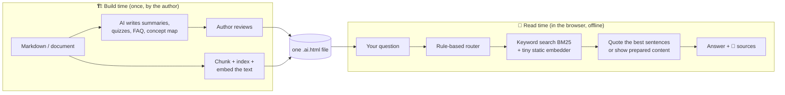

<div align="center">

# 📄💬 aidoc

### Documents that answer your questions, offline and private.

**One HTML file. Double-click to open. Ask it anything.**<br>
No app · No account · No internet · No tracking

-orange)


### [⬇️ Download the demo: `transformer.ai.html` (5 MB)](https://github.com/Vibinreji/aidoc/blob/main/demo/transformer.ai.html)

<sub>Opens the file page on GitHub. Click the **Download raw file** button (⬇) at the top right, then double-click the downloaded file.</sub>

</div>

---

## ✨ What is this?

An **`.ai.html`** file is a normal-looking document with a built-in **"Ask this document"** panel:

| | |
|---|---|
| 🔎 **Search** | Keyword + meaning-based search. Click a result to jump to it and highlight it. |
| ❓ **Ask questions** | Answers quoted from the document, always with 📍 source links. |
| 📝 **Summarize** | A summary of the section you're reading, or of the whole document. |
| 🧒 **Explain simply** | The plain-language version of any section. |
| 🎯 **Quiz me** | Multiple-choice quizzes with scores and explanations. |
| 🕸️ **Concepts** | "How is X related to Y?" shown as a chain through a concept map. |
| 🙅 **Honest** | If the document doesn't cover it, it says so: *"This document doesn't seem to cover that."* |

All of it runs **inside the file**. Your questions never leave your device. The file is **technically unable** to make a network request: its Content Security Policy blocks all of them, and our tests fail if even one is attempted.

## 🚀 Try it in 10 seconds

1. **[Download `transformer.ai.html`](https://github.com/Vibinreji/aidoc/blob/main/demo/transformer.ai.html)**, using the ⬇ *Download raw file* button.
2. Double-click it. It opens in Chrome, Edge, Firefox or Safari.
3. Press **`/`** or click **💬 Ask this document**, then try:
   - *What is the KV cache for?*
   - *How is the KV cache related to the causal mask?*
   - *ELI5 Q/K/V*
   - *Quiz me*
   - *Who won the 2022 World Cup?* ← it should refuse

> Turn off your Wi-Fi first if you want to prove it works offline. 😉

## 🧠 How does it work without an AI model inside?

A useful chatbot model is gigabytes, far too big for a document. So aidoc splits the work:



- **Expensive AI work happens once, at build time.** Its output is stored in the file as plain data the author can review.
- **Cheap, deterministic work happens at read time:**
  - BM25 keyword search;
  - a ~5 MB static embedder ([model2vec `potion-base-8M`](https://huggingface.co/minishlab/potion-base-8M), MIT): a word-vector lookup table, not a neural network;
  - sentence extraction from the document.
- **Every answer shows where it came from.** It is either 📄 *Found in the document* or ✍️ *Prepared by the author*.

## 🔒 Security by design

- **Only one script can run**: the official aidoc runtime, pinned by its SHA-256 hash in the Content Security Policy. Documents can't ship their own JavaScript.
- **`connect-src 'none'`**: no fetch, XHR, WebSocket, beacons, remote images, fonts or frames. Verified in Chromium, Firefox and WebKit.
- **Sanitized content.** Things the CSP alone doesn't stop are stripped at build time: `<meta http-equiv="refresh">` redirects, and `<link rel="preconnect">`, which opens a connection in Safari.
- **Data is inert.** It is parsed with `JSON.parse` only, inserted as text only, and every block's hash is verified.
- **Damaged data fails gracefully.** The document always stays readable.

## 📊 Measured, not claimed

Sample document: about 5,000 words, 11 sections, 3 diagrams.

| Metric | Result |
|---|---|
| File size | **5.1 MB** (embedder 4.9 MB · everything else ≈ 210 KB) |
| Runtime size | **36 KB** JS + 8 KB CSS |
| Open → ready | **~0.2–0.4 s** |
| Answer time | **< 10 ms**, even on a 337-page test document |
| Right section in top 3 | **44 / 46** test questions |
| Off-topic questions rejected | **15 / 15** clearly off-topic · **7 / 10** close to the topic |
| Network requests | **0**, enforced by the automated tests |
| Tokenizer parity with Hugging Face | **499 / 499** strings |

Full numbers and the reasoning behind every choice are in [`docs/decisions.md`](docs/decisions.md).

## 🗺️ Roadmap

| Phase | What | Status |
|---|---|---|
| **0 · Verify** | Test `file://` + CSP in 3 browser engines, check licences and the tokenizer | ✅ Done |
| **1 · Spec + sample** | Format spec draft, JSON Schemas, the Transformer sample with generated content | ✅ Done |
| **2 · Working file** | Tokenizer, embedder, BM25, sanitizer, chunker, packager, runtime panel, CLI, tests | ✅ Done |
| **3 · Converter** | Word, PDF and HTML input · drag-and-drop converter page | 🔜 Next |
| **4 · Benchmarks** | Larger test set, quality and speed across browsers | ⏳ Planned |
| **5 · MCP server** | Let AI tools (Claude, etc.) create aidoc files | ⏳ Planned |
| **6 · Launch** | Docs, demo GIF, contributor guide, security write-up | ⏳ Planned |

<details>
<summary><b>✅ What's in Phases 0–2</b></summary>

- **Phase 0: verify assumptions.** Playwright probes in Chromium, Firefox and WebKit. They prove that a hash-pinned inline script runs from `file://`, that unhashed scripts and inline handlers are blocked, and that every network channel is blocked.
  - Found two leaks the CSP can't stop (meta refresh in every engine, preconnect in WebKit); the sanitizer now strips both.
  - Found that Playwright's Firefox weakens `file://` isolation by default, and corrected the test setup.
- **Phase 1: spec + sample.**
  - [`spec/aidoc-0.1.md`](spec/aidoc-0.1.md) (CC BY 4.0) with 6 JSON Schemas.
  - The "Understanding Transformer Architecture" document with 64 FAQ entries, 45 quiz questions and a 36-concept graph.
- **Phase 2: a working document.**
  - A WordPiece tokenizer in TypeScript that exactly matches Hugging Face's.
  - The static embedder, compressed from 256 to 128 dims with no loss in retrieval quality, which halves its size.
  - BM25 keyword search fused with the embedder's semantic search.
  - A rule-based router for search, summaries, simple explanations, quizzes, concept relations and questions.
  - Extractive answers and an out-of-scope detector that also checks the question's important words appear in the document.
  - An accessible panel with keyboard support, a mobile bottom sheet and dark mode.
  - The `aidoc build` and `aidoc inspect` CLI.
  - 15 unit tests, 15 end-to-end browser tests and 12 platform probes.

</details>

<details>
<summary><b>🔜 Phase 3: converter (next)</b></summary>

- **Inputs:** `aidoc build` accepts **Markdown, Word (.docx), HTML and PDF**.
- **PDF mode:** the original PDF is embedded and rendered inside the file, answers highlight the exact spot on the page, and a "Download original PDF" button is included. Still fully offline.
- **Pluggable content generation:** `--generate none | ollama | anthropic | openai`. Cloud providers only run with an explicit flag and the author's own API key, and they are recorded in the file's provenance.
- **Incremental rebuilds:** only changed sections are re-processed.
- **`aidoc validate`** checks schemas, hashes, CSP, sanitization and broken references. **`aidoc extract`** gets clean Markdown back out.
- **A drag-and-drop converter page,** itself an offline HTML file: drop in a document, download an `.ai.html`.

</details>

<details>
<summary><b>⏳ Phases 4–6</b></summary>

- **Phase 4: benchmarks.**
  - 40+ new held-out questions.
  - Measures hit@1/hit@3, answer correctness, out-of-scope precision, latency, startup time, memory and size per component.
  - Compares BM25 vs. embedder vs. hybrid and the embedder size variants, and tries optional built-in browser AI for rephrasing only.
- **Phase 5: MCP server.** Tools so an AI assistant can create documents, add sections, summaries, quizzes and relations, then build and validate them. The AI writes the meaning; aidoc does the chunking, embedding and packaging.
- **Phase 6: launch.** Full docs, a demo GIF, "how it works" diagrams, a threat model ([`docs/security.md`](docs/)), a contributor guide and good-first-issues.

</details>

## ⚠️ Honest limitations

- **It doesn't write new sentences.** Answers are quoted from the document or written in advance by the author. That's less fluent than a chatbot, but it can't make things up.
- **Questions close to the topic can slip through.** Some near-topic questions get a weak quoted answer instead of "not covered" (3 of 10 in our test set).
- **One document so far.** Thresholds are tuned on one sample, and broader benchmarks come in Phase 4.
- **The demo's AI-generated content hasn't had a human review yet.** The panel labels it *"AI-generated, not reviewed"*.

## 🛠️ Build it yourself

Requires Node 20+.

```bash
git clone https://github.com/Vibinreji/aidoc.git && cd aidoc
npx pnpm@9 install
npx pnpm@9 build       # runtime + CLI
npx pnpm@9 example     # → dist/transformer.ai.html (downloads the embedder once, at build time only)
npx pnpm@9 inspect     # size report + integrity check
npx pnpm@9 test        # unit tests
npx pnpm@9 test:e2e    # browser tests (run `npx playwright install` first)
```

Write your own document in Markdown, then build it:
`node packages/cli/dist/aidoc.js build my-doc/ -o my-doc.ai.html`. The folder must contain `document.md`, and can optionally include `generated.json` and `graph.json`.

<details>
<summary><b>📁 Repository layout</b></summary>

```text
spec/                 format specification (aidoc-0.1.md) + JSON Schemas
packages/core/        tokenizer, embedder, BM25, Markdown → sanitized content, chunking, packaging
packages/runtime/     the inline runtime: question engine + panel UI + styles
packages/cli/         aidoc build | inspect
examples/transformer/ sample source: document.md, generated.json, graph.json
demo/                 ready-to-open transformer.ai.html
benchmarks/           eval questions, calibration, scale benchmark
tests/                Playwright: file:// platform probes, end-to-end with the network off
docs/decisions.md     every decision with the measurements behind it
```

</details>

## 📜 Licence

- **Code:** Apache-2.0 ([LICENSE](LICENSE)).
- **Specification and schemas:** CC BY 4.0 ([LICENSE-SPEC](LICENSE-SPEC)).
- **Bundled embedder:** [`minishlab/potion-base-8M`](https://huggingface.co/minishlab/potion-base-8M) is MIT. All dependencies are MIT, BSD, ISC or Apache; see [`docs/decisions.md`](docs/decisions.md).

<div align="center">
<sub>Built in the open. Every number in this README is measured and reproducible from this repo.</sub>
</div>
